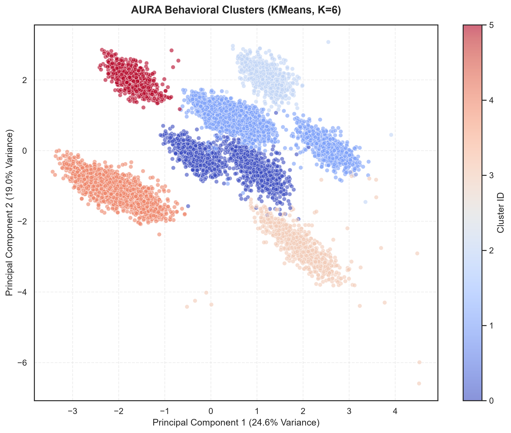

# AURA Pattern Recognition Model — Training Report

**Generated**: 2026-07-30 03:55:19 UTC

---

## 1. Dataset & Clustering Strategy

| Property | Value |
|---|---|
| Total Samples | 960,000 |
| Number of Scenarios Merged | 12 |
| Clustering Algorithm | KMeans |
| Distance Metric | Euclidean |
| Selection Method | Automatic via Silhouette Score |
| Optimal Clusters (K) | **6** |

---

## 2. Evaluation Metrics

These metrics were calculated on a representative, stratified sample of 10,000 telemetry readings:

| Metric | Value | Interpretation |
|---|---|---|
| **Silhouette Score** | **0.2712** | Measures cluster cohesion & separation (closer to 1 is better) |
| **Davies-Bouldin Index** | **1.4836** | Average similarity between each cluster and its most similar one (lower is better) |
| **Calinski-Harabasz Score** | **2050.3754** | Ratio of sum of between-clusters scatter to within-cluster scatter (higher is better) |

---

## 3. Cluster Breakdown & Descriptions

### Summary Table

| Cluster ID | Size (Samples) | Size (%) | Top Activity | Primary Location | Peak Time | Avg HR (bpm) | Avg Noise (dB) | Avg Temp (°C) |
|---|---|---|---|---|---|---|---|---|
| **0** | 159,816 | 16.65% | Walking | Indoor - Religious | Morning | 82.3 | 49.5 | 37.04 |
| **1** | 320,233 | 33.36% | Sitting | Transit | Morning | 79.3 | 87.1 | 36.96 |
| **2** | 79,929 | 8.33% | Walking | Outdoor - Street | Morning | 83.2 | 77.9 | 37.00 |
| **3** | 81,035 | 8.44% | Exercising | Indoor - Fitness | Morning | 133.0 | 79.9 | 37.28 |
| **4** | 239,154 | 24.91% | Sitting | Indoor - Medical | Morning | 75.4 | 43.7 | 36.95 |
| **5** | 79,833 | 8.32% | Walking | Indoor - Residential | Morning | 72.0 | 31.7 | 36.91 |

---

## 4. Visualizations

The high-dimensional features were projected to two dimensions using Principal Component Analysis (PCA) for visualization:

---

## 5. Feature Architecture & Preprocessing

- **Noise**: Standardized decibel readings (`noise_db`)
- **Heart Rate**: Heart rate in beats per minute (`heart_rate`)
- **Temperature**: Body temperature in Celsius (`body_temperature`)
- **GPS**: Location coordinates (`latitude`, `longitude`)
- **Time**: Extracted hour of day (`hour`) and categorical time of day (`time_of_day`)
- **Activity**: Categorical activity states (`activity`)
- **Environment**: Categorical location types (`location_type`) plus ambient temperature and humidity.

All numeric features were imputed with their median and standardized using `StandardScaler`. Categorical features were one-hot encoded after imputation of the most frequent values. The preprocessor pipeline is exported directly inside the model bundle.
